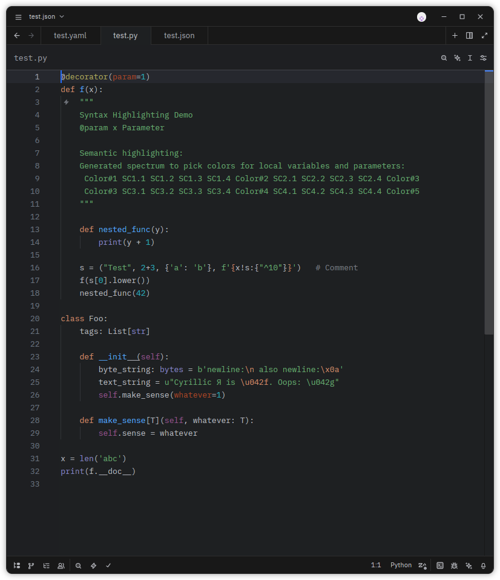
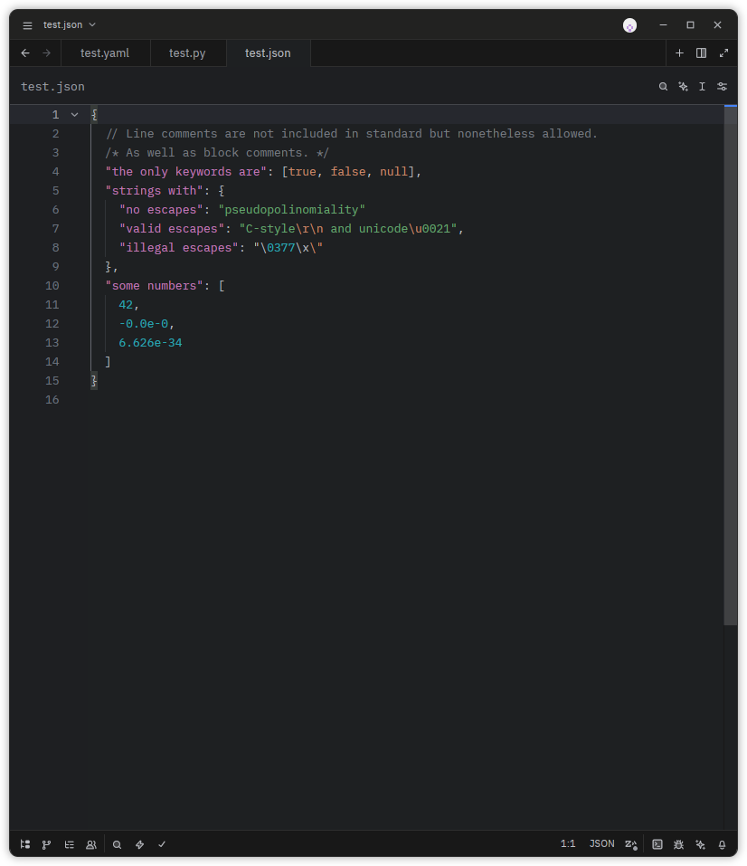
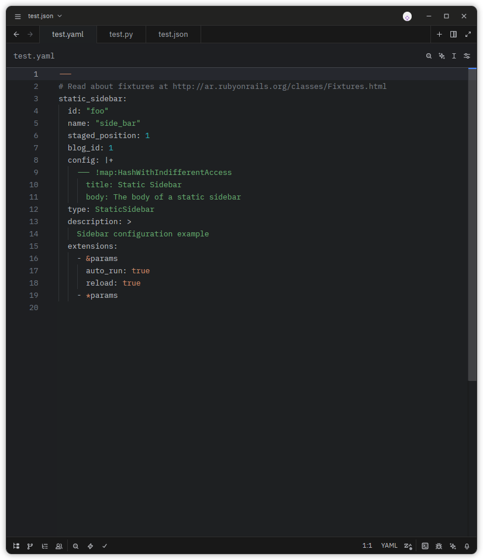

# Pycharm Modern Themes

Themes for [Zed](https://zed.dev) inspired by PyCharm's Modern themes color scheme.

## Themes

- **Dark Stealth** — A sleek dark theme inspired by PyCharm's Dark theme with darker UI and terminal colors

  #### Preview
  
  
  
  
  
  

### From Zed

1. Open Zed
2. Press `Cmd+Shift+X` (macOS) or `Ctrl+Shift+X` (Linux) to open settings
3. Search for "PyCharm Modern Themes" in the extensions marketplace
4. Click Install

### Manual

1. Clone this repository:
   ```bash
   git clone https://github.com/injirez/zed-pycharm-modern-theme.git
   ```
2. Press `Cmd+Shift+X` (macOS) or `Ctrl+Shift+X` (Linux) to open settings
3. Click on Install Dev Extension
   - Navigate to the cloned repository directory
   - Click on Install Dev Extension
4. Select the theme in settings
